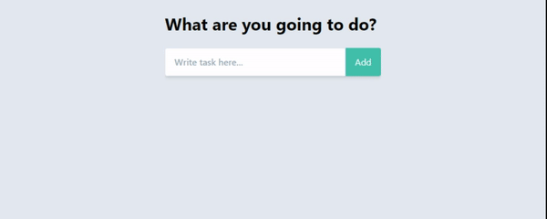

# Todo list in React

Find here a simple todo list application developed with [React](https://reactjs.org/). To view the project in action follow this link [https://wardis.github.io/todo-react/](https://wardis.github.io/todo-react/).

I styled the user interface using the utility first CSS framework [Tailwind CSS](https://tailwindcss.com/)

## Available Script

In the project directory, you can run:

### `npm start`

Runs the app in the development mode. 
Open [http://localhost:3000](http://localhost:3000) to view it in the browser.